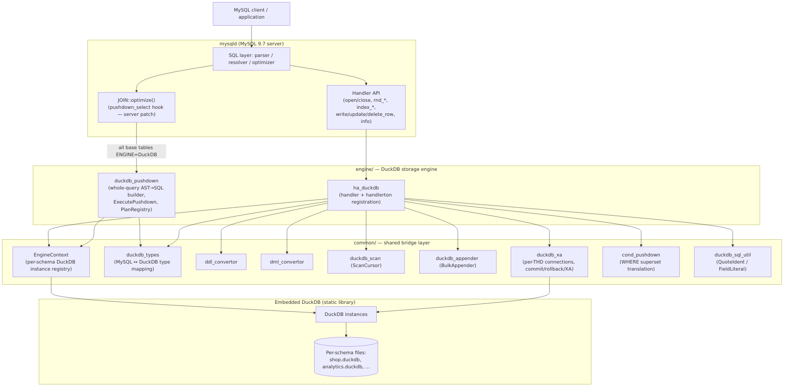
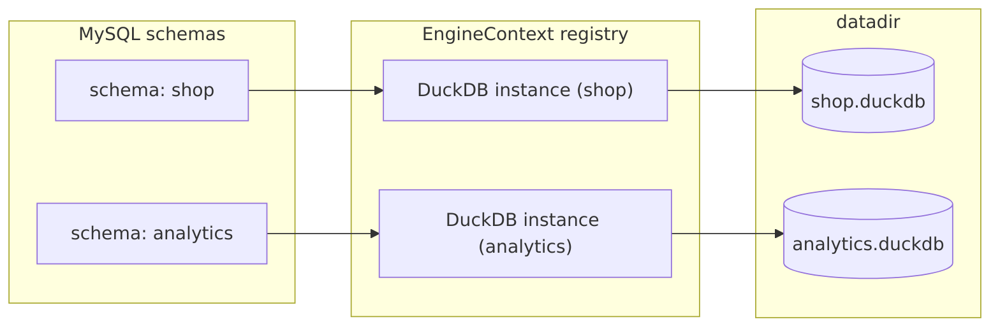
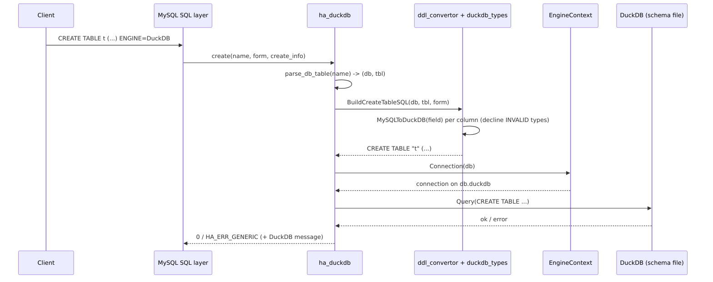
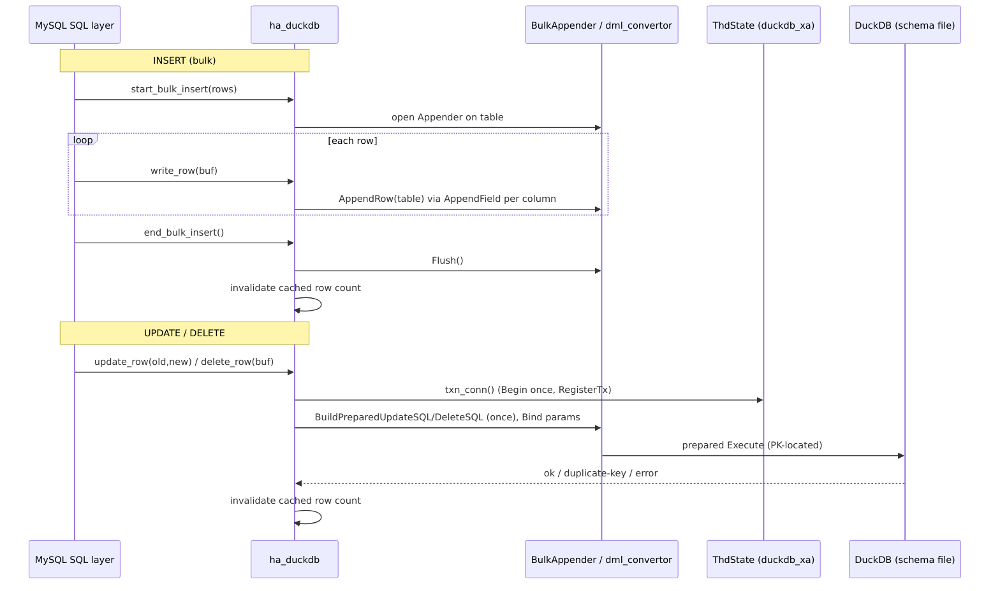
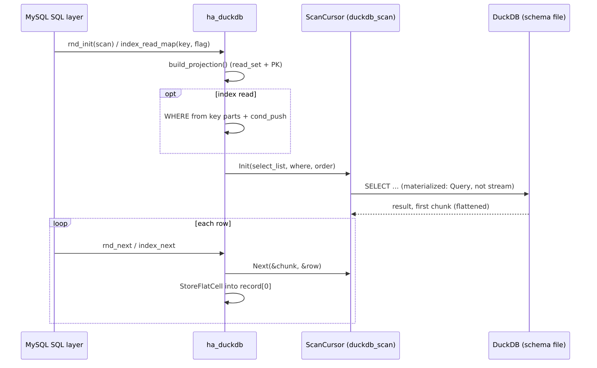
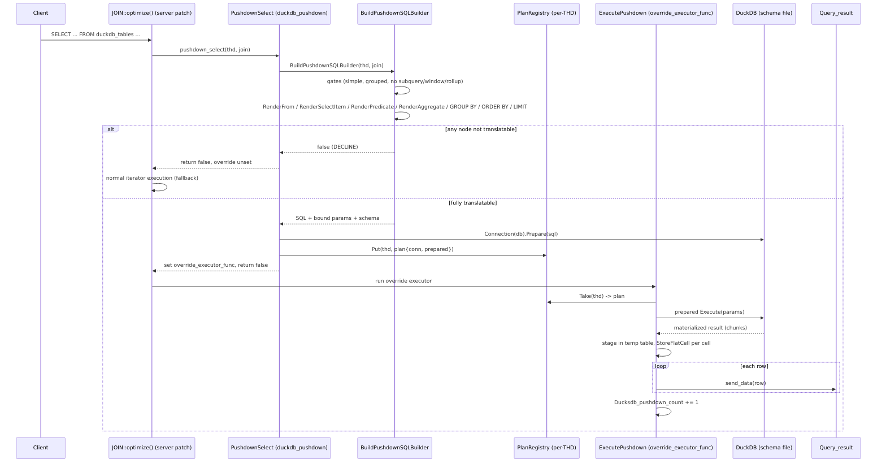
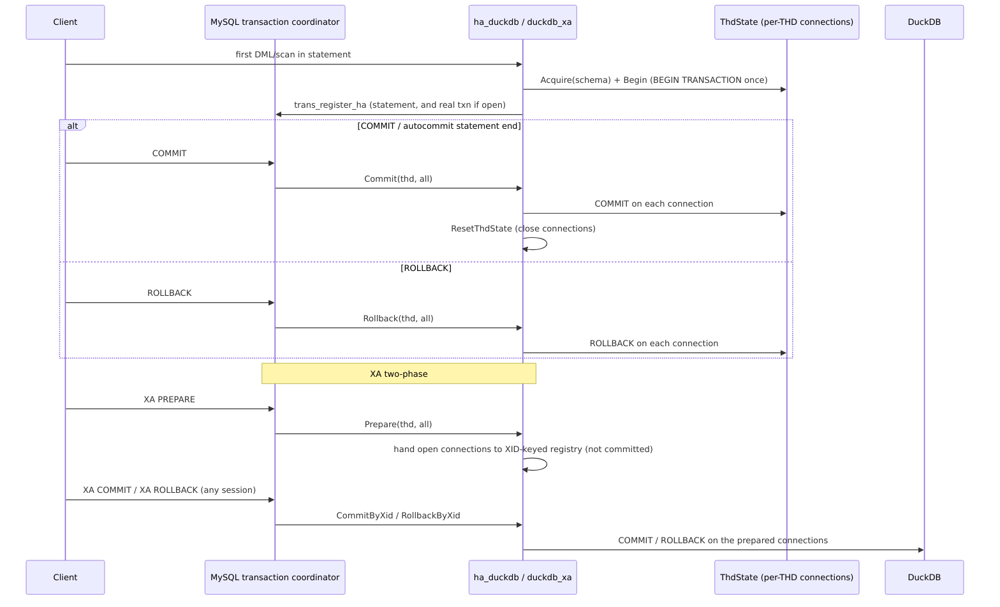

# Architecture

This document describes the components of the DuckDB storage engine, how they fit
together, and the data flow for each important code path: DDL, the write path,
the read path, whole-query pushdown, and transactions. It also explains the
decline contract (when a query is pushed down versus when it falls back to normal
MySQL execution) and the per-schema file model.

## Components

The engine is built into `mysqld` and is organized in three layers: the handler
shim (`engine/`), the shared bridge layer (`common/`), and embedded DuckDB. A
small server patch adds the `pushdown_select` hook that the engine uses for
whole-query offload.

### Layer responsibilities

- **`ha_duckdb`** (`engine/ha_duckdb.cc`, `.h`) — the MySQL `handler` subclass.
  It implements DDL (`create` / `delete_table` / `rename_table`), table open and
  close, sequential scans (`rnd_init` / `rnd_next` / `rnd_end`), index reads
  (`index_init` / `index_read_map` / `index_next` / `index_first` /
  `index_last`), single-row writes (`write_row` / `update_row` / `delete_row`),
  bulk insert (`start_bulk_insert` / `end_bulk_insert`), `truncate`, and
  optimizer statistics (`info` / `records_in_range`). It also registers the
  handlerton callbacks in `ducksdb_init_func`, including the transaction/XA
  callbacks and the `pushdown_select` hook.

- **`duckdb_pushdown`** (`engine/duckdb_pushdown.cc`, `.h`) — the whole-query
  pushdown. `PushdownSelect` is the `handlerton::pushdown_select` callback.
  `BuildPushdownSQLBuilder` is a recursive AST-to-SQL builder (`RenderFrom`,
  `RenderExpr`, `RenderAggregate`, `RenderPredicate`, `RenderSelectItem`) that
  turns the optimized `JOIN` into parameterized DuckDB SQL. `ExecutePushdown` is
  installed as `JOIN::override_executor_func` and streams the DuckDB result back
  through the statement's `Query_result`. `MapCollation` decides how a MySQL
  collation maps into DuckDB. A process-global counter backs the
  `Ducksdb_pushdown_count` status variable.

- **`EngineContext`** (`common/duckdb_engine_context.cc`, `.h`) — the per-mysqld
  registry that maps each MySQL schema to one DuckDB instance (one `.duckdb`
  file), creating it lazily and serving `Connection()` factories on it. Backs the
  `Ducksdb_open_instances` status variable.

- **`duckdb_types`** (`common/duckdb_types.cc`) — the type bridge:
  `MySQLToDuckDB` (column type mapping), `AppendField` (write a MySQL field into a
  DuckDB Appender), `FieldToValue` (a MySQL field to a bound DuckDB `Value`),
  `StoreField` / `StoreFlatCell` (a DuckDB cell back into a MySQL field).

- **`ddl_convertor`** / **`dml_convertor`** — build DuckDB `CREATE TABLE` /
  `DROP TABLE` / `ALTER TABLE ... RENAME` SQL, and the parameterized
  `UPDATE`/`DELETE` statements plus their bind-parameter packing.

- **`duckdb_scan`** (`ScanCursor`) — runs a materialized `SELECT` against a table
  and iterates the result chunk by chunk.

- **`duckdb_appender`** (`BulkAppender`) — wraps a DuckDB `Appender` for fast
  bulk insert.

- **`duckdb_xa`** — per-THD connection state (`ThdState`) and the transaction /
  XA handlerton callbacks.

- **`cond_pushdown`** — translates the safely-pushable, superset part of a
  handler-level pushed condition (`cond_push`) into a DuckDB `WHERE` applied
  during scans.

### The server patches

The engine depends on three small server patches, applied into the MySQL source
tree by `scripts/build-server.sh` (idempotent — each is skipped if already
present). Every patch is generic (keyed on `handlerton::pushdown_select`, not on
the DuckDB engine specifically) and ABI-safe.

[`0001-engine-query-pushdown.patch`](../server-patches/0001-engine-query-pushdown.patch)
— the pushdown hook:

- `sql/handler.h` — the `pushdown_select_t` typedef and a
  `handlerton::pushdown_select` member. The member is zero-filled by default, so
  it is null for every other engine.
- `sql/sql_optimizer.cc` — a `single_engine_for_pushdown()` helper that returns
  the common handlerton iff every base table of the query block belongs to the
  same engine (recursing through derived tables), and a call near the tail of
  `JOIN::optimize()` (gated on `!is_explain()`) that invokes that engine's
  `pushdown_select`. If the engine sets `JOIN::override_executor_func`, the
  optimizer installs a trivial root access path and marks the plan ready; the
  override runs the query instead. Declining leaves normal iterator execution
  untouched.

[`0002-engine-bulk-load.patch`](../server-patches/0002-engine-bulk-load.patch)
— a `LOAD DATA` fast path: a `handlerton::load_into` hook in
`Sql_cmd_load_table::execute_inner` lets the engine ingest a server-side
`INFILE` directly via DuckDB `COPY` (no per-row handler dispatch), falling back
to the row path for `LOCAL`, `SET`, triggers, binlog, or non-identity column maps.

[`0003-engine-semijoin-suppression.patch`](../server-patches/0003-engine-semijoin-suppression.patch)
— in `Sql_cmd_dml::prepare`, an RAII guard clears `OPTIMIZER_SWITCH_SEMIJOIN`
for statements whose base tables are all one pushdown engine. This keeps `IN` /
`EXISTS` predicates intact as subquery `Item`s in the `WHERE` (instead of being
flattened into semijoin nests or hidden behind a materialization temp table), so
the builder can render them as native DuckDB `IN` / `EXISTS`. It is transparent:
a query that ultimately declines still executes correctly on the row path —
turning semijoin off only changes the plan, never the result.

## Per-schema file model

Each MySQL schema maps to exactly one DuckDB database file. `EngineContext`
computes the path as `<mysql_real_data_home>/<schema>.duckdb` and keeps a
process-wide registry of open instances, created lazily on first use and
protected by a shared mutex.

A direct consequence is that a single DuckDB statement cannot span two schemas:
the whole-query pushdown builder enforces a **single-schema guard** (all base
tables must live in the same `.duckdb` file), and cross-schema `RENAME` is
rejected because an in-file rename cannot move a table to a different file.

## DDL path: CREATE TABLE → DuckDB

When a client issues `CREATE TABLE ... ENGINE=DuckDB`, MySQL calls
`ha_duckdb::create`. The handler parses the schema and table name out of the
path-style argument, builds a DuckDB `CREATE TABLE` from the MySQL column
definitions and primary key, and runs it on a connection to that schema's file.
`DROP TABLE`, `RENAME`, and `TRUNCATE` follow the same shape.

Unsupported column types cause `BuildCreateTableSQL` to throw, which the handler
turns into a clear error rather than creating a partial table.

## Write path

There are three write shapes. Bulk insert (the `INSERT ... VALUES` /
`LOAD DATA` path) uses a DuckDB `Appender` for speed. `UPDATE` and `DELETE` use
parameterized prepared statements keyed on the primary key. All writes route
through the per-THD, transaction-scoped connection (`txn_conn()`), which begins
the DuckDB transaction once and registers the engine with MySQL's transaction
coordinator.

The prepared `UPDATE`/`DELETE` plans are created lazily on first use and dropped
at the statement boundary (`reset()`). If the primary key is absent, or the
prepared plan cannot be built, the engine falls back to a per-row prepared
statement built from the row's values (still parameterized, never string
concatenation). DuckDB errors are mapped to MySQL handler codes
(`MapDuckDBError`), so a unique-constraint violation surfaces as `ER_DUP_ENTRY`.

## Read path (point lookup / scan)

A non-pushed query reads rows through the handler API. `rnd_init` opens a
materialized `SELECT` projecting only the columns the optimizer reads (plus the
primary key, so `UPDATE`/`DELETE` can locate rows). Index reads add a `WHERE`
derived from the key and the comparison operator, plus any condition pushed via
`cond_push`. Results are fetched chunk by chunk and decoded directly from
DuckDB's column vectors with typed accessors (`StoreFlatCell`).

The scan deliberately materializes the result (`Query`, not a streaming
`SendQuery`) so a full-scan `UPDATE`/`DELETE` that issues per-row writes on the
same connection mid-scan does not deadlock against a busy streaming cursor.

## Whole-query pushdown path

This is the analytical fast path. After the optimizer finishes a query whose base
tables are all `ENGINE=DuckDB`, the server hook calls `PushdownSelect`. The
builder walks the optimized query block and, if every node is translatable,
produces parameterized DuckDB SQL, prepares it once, and stashes the plan in a
per-THD registry. The optimizer then installs `ExecutePushdown` as the override
executor. At execute time the prepared statement runs in DuckDB and the result is
staged into a temporary table and streamed back to the client.

### The decline contract

The builder is a **partial function**: every `Render*` helper returns success or
declines, and any decline bubbles up so `BuildPushdownSQLBuilder` returns false
and MySQL executes the query normally. Declining is always safe; emitting SQL
that is not provably identical is not. The builder never concatenates literals —
every literal is bound as a positional DuckDB parameter (`$1`, `$2`, ...), which
removes the escaping and injection surface entirely.

A query is pushed down only when **all** of the following hold:

- It is a simple (non-`UNION`) query block with at least one base table.
- It is worth offloading: it is grouped or implicitly grouped (an aggregate
  query), **or** it carries a `LIMIT`, **or** it is a multi-table join. A bare
  single-table, non-grouped, no-`LIMIT` query (a point lookup or full scan) stays
  on the row path, where an index seek is faster than staging.
- It has no window function, no `ROLLUP`, and no statement parameters.
- Every base table is `ENGINE=DuckDB` and all tables share one schema (one
  `.duckdb` file). Cross-schema joins decline.
- **Joins** render across shapes: inner joins (a cross product plus a `WHERE`
  conjunct), outer joins (a `LEFT JOIN … ON` tree mirroring the server's join
  nest), and materialized **derived tables** / **CTEs** (rendered as inline
  `(SELECT …) AS alias`; a CTE referenced more than once is inlined per
  reference). Recursive CTEs decline.
- **Subqueries** render natively: scalar subqueries (correlated and
  uncorrelated), and `IN` / `EXISTS` / `NOT IN` / `NOT EXISTS` predicates. The
  latter rely on a server patch that suppresses semijoin flattening for engine
  candidates so the predicate survives as a renderable subquery (see below);
  `ALL` / `ANY` / row subqueries, `UNION` subqueries, and `LATERAL` dependencies
  decline.
- Every select-list item, predicate, `GROUP BY` / `ORDER BY` term, and aggregate
  renders. Supported aggregates: `COUNT`, `COUNT(*)`, `COUNT(DISTINCT)`, `SUM`,
  `SUM(DISTINCT)`, `AVG`, `AVG(DISTINCT)`, `MIN`, `MAX`. Supported scalar
  operators/functions: `+ - * /`, comparisons, `BETWEEN`, `IN`, `IS [NOT] NULL`,
  `NOT`, collation-aware `LIKE`, searched `CASE`, `EXTRACT(YEAR|QUARTER|MONTH|DAY)`,
  and `SUBSTRING`. Other functions (e.g. `GROUP_CONCAT`, window aggregates, most
  string/date functions) decline.
- Literals map exactly: integers, `DECIMAL`, and any optimizer-folded constant are
  bound as positional parameters; temporal constants (e.g. `CAST('1998-09-02' AS
  DATE)`) bind; `NULL` binds as a typed NULL. `REAL` / `DOUBLE` literals decline
  (ULP drift). `SUBSTRING` position/length are emitted inline so the same
  expression is textually identical across `SELECT` / `GROUP BY` / `ORDER BY`.
- Every string column's collation maps (see below); otherwise it declines so a
  case or accent difference cannot change ordering, grouping, or `DISTINCT`.
- `EXPLAIN` is excluded by the server hook, so `EXPLAIN` always shows a normal
  plan.

Because the optimizer hook only fires when every base table belongs to one
engine, non-`ENGINE=DuckDB` queries are never offered to the engine in the first
place, and a mixed-engine join is never a candidate.

All 22 TPC-H queries are pushed down and return results identical to InnoDB on
the same data (the subquery shapes above cover the constructs they exercise —
correlated `EXISTS`, grouped `IN`, `NOT IN`, `NOT EXISTS`, nested `IN`, CTE, and
`SUBSTRING`).

### Collation mapping

`MapCollation` decides how a column's collation renders in DuckDB:

| MySQL collation kind | DuckDB rendering | Result |
|----------------------|------------------|--------|
| `_bin` / `binary` (byte-comparable) | default byte compare, no `COLLATE` | push down |
| accent- and case-insensitive default family (`_ai_ci`, `_general_ci`, `_unicode_ci`) | `COLLATE NOCASE` | push down |
| case-sensitive non-binary, accent-sensitive `_ci`, or unknown | — | decline |

This keeps ordering, grouping, and `DISTINCT` semantics faithful for the common
default-collation and binary cases, and conservatively declines anything whose
ordering `NOCASE` does not approximate.

### Plan lifetime

The prepared plan (and its DuckDB connection) is owned by a registry keyed by the
owning `THD`, not by a thread-local. A `THD` runs its statements serially, so at
most one plan is live per session. `PushdownSelect` drops any stale plan, installs
the new one, and `ExecutePushdown` takes and releases it (its `unique_ptr`
releases the connection deterministically). The `close_connection` handlerton
callback releases any plan left by an optimize-without-execute, so a connection
cannot leak past disconnect even under a thread pool.

## Transaction / commit (XA) flow

Each connection (`THD`) keeps one DuckDB connection per schema it has touched,
held in a `ThdState` stored on `THD->ha_data`. The first DML or scan begins the
DuckDB transaction (once) and registers the engine with MySQL's transaction
coordinator, so MySQL drives the engine's commit and rollback.

A statement-level commit inside an explicit `BEGIN ... COMMIT` transaction is a
no-op; the DuckDB transaction stays open until the explicit `COMMIT`/`ROLLBACK`.
The handlerton callbacks are C-ABI boundaries, so each body is wrapped to never
let a C++ exception escape into `mysqld`.

For XA, `Prepare` hands the THD's still-open connections to an in-memory registry
keyed by the XID; `CommitByXid` / `RollbackByXid` can finish them from any
session with real DuckDB semantics. Because the prepared state lives only in
memory, prepared branches do not survive a crash or restart — `Recover` returns
none, which is the documented limitation of the in-memory strategy. Each schema
is a separate DuckDB file with no cross-file two-phase commit, so a multi-schema
XA commit is best-effort: if one branch fails to commit, the remaining
not-yet-committed branches are rolled back to limit divergence.
